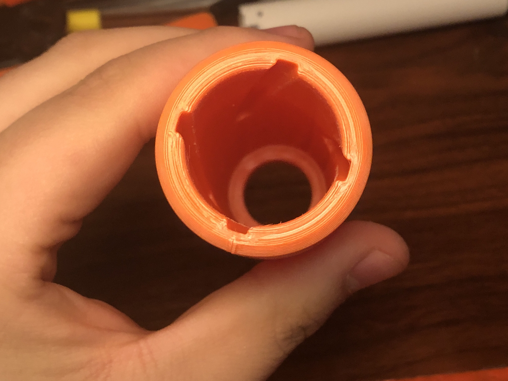
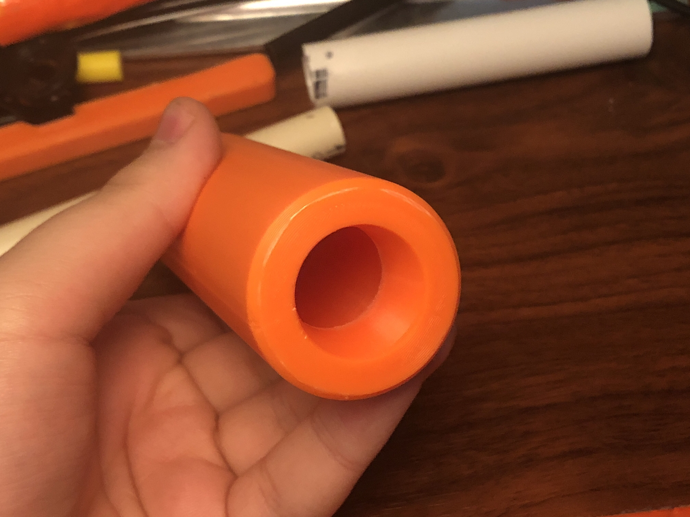
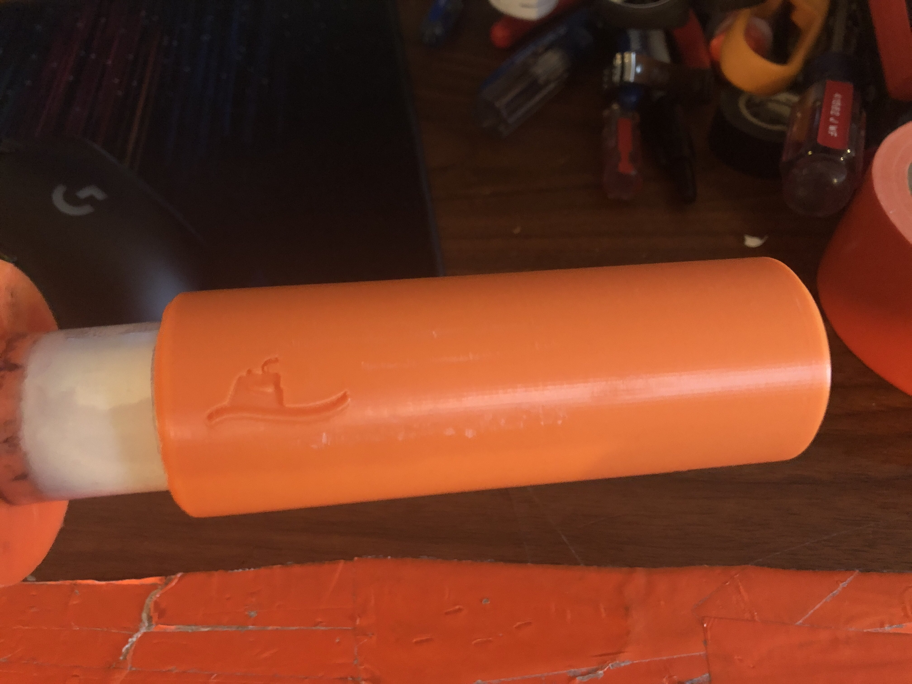

# Twirly MegaXL Barrel
A super-accurate MegaXL barrel that imparts a spin on the dart as it exits the barrel. 

# PLEASE READ
### UPON FURTHER TESTING, I HAVE FOUND A BETTER BARREL DESIGN. THE TWIRLY BARREL ONLY OFFERED MARGINAL IMPROVEMENT UPON A SMOOTH BARREL, AND ONLY AT HIGH AIR VOLUME. THE NEW BARREL ALSO ONLY REALLY WORKS AT HIGH AIR VOLUME, BUT IS NOTICEABLY MORE ACCURATE THAN SMOOTH BARRELS. THE NEW BARREL CAN BE FOUND HERE: https://github.com/Sillybutts/TrivictusMegaXLBarrel

### I AM LEAVING THIS PAGE UP FOR ARCHIVAL AND DEVELOPMENTAL REASONS. IF YOU THINK YOU CAN DO SOMETHING INTERESTING WITH THE TWIRLY BARREL, THE FILES ARE STILL AVAILABLE HERE.

The story of why I made this barrel is pretty long, so here it is all in a drop-down menu. Feel free to read if you want. (Click this text)

PLEASE READ
UPON FURTHER TESTING, I HAVE FOUND A BETTER BARREL DESIGN. THE TWIRLY BARREL ONLY OFFERED MARGINAL IMPROVEMENT UPON A SMOOTH BARREL, AND ONLY AT HIGH AIR VOLUME. THE NEW BARREL ALSO ONLY REALLY WORKS AT HIGH AIR VOLUME, BUT IS NOTICEABLY MORE ACCURATE THAN SMOOTH BARRELS. THE NEW BARREL CAN BE FOUND HERE: https://github.com/Sillybutts/TrivictusMegaXLBarrel
I AM LEAVING THIS PAGE UP FOR ARCHIVAL AND DEVELOPMENTAL REASONS. IF YOU THINK YOU CAN DO SOMETHING INTERESTING WITH THE TWIRLY BARREL, THE FILES ARE STILL AVAILABLE HERE.

Gather around everyone, it's story time.

This text might not flow very well when read, but I have written it in the most blunt and neutral tone possible in order to avoid any confusion.

Armatus has a friend. They run a shop. I and a friend of mine removed our stuff from their shop. The shop owner was very cooperative and reasonable. 

On his own volition, Armatus decided to harass myself (Sillybutts) and my friend for dropping the shop as a seller. Armatus did this on his own, and we hold no ill-will toward the shop owner.

I had been using, with permission, a MegaXL barrel made by Armatus, called the MegaXL Twisty barrel. It used 3 twisted flutes near the end of the barrel to impart a spin upon the dart. He told me to stop using it, and to "have fun designing your own".

So, I did!

This is the MegaXL Twirly barrel, which uses 4 spiral flutes at the tip of the barrel to spin the dart when going down the barrel. MegaXL benefits from spin much more than standard darts, because drag stabilization falls apart with MegaXL's size and weight balance.
  
In testing, my barrel has been slightly more accurate than the Armatus Twisty barrel, and also doesn't have sharp pointy bits at the tip like his.

The MegaXL Twirly barrel uses no intellectual property (IP) of Armatus Designs. It was created from the ground up, using my (Sillybutts) own measurements. It is a straight walled barrel for the first half, with 4 flutes in the last 45mm of barrel. 

I have included 3 versions of the barrel in this file:
- A version that attaches to the end of a Schedule 40 / 1/2 inch PVC barrel

- A version that attaches to the end of a 16mm barrel (Such as 1/2in CPVC and metal barrels used for normal sized darts.)

- A blank version of the barrel for you to use in your own designs, whether that be in a harmonica clip, revolver cylinder, barrel attachment, SCAR attachment, or whatever else you come up with!

On all of these variants, there is a logo present. The logo is for Submarino Fab (Spud Spudoni), who helped with refining the flute profile. If you use this barrel in a design, we would appreciate it if you put the Subarmino logo somewhere on/near the barrel. But if you can't fit it in, don't worry about it :). I (Sillybutts) don't have a printable logo at the moment, so just credit me wherever you release your design.

By the way, I have included some chat screenshots of Armatus as canvases on this page. Feel free to scroll down and read those.

Please do not harass anyone involved in this story, whether that be me, Armatus, the shop owner, or my friend. Harassment is bad.

I think that's everything I need to say here, so go and have fun with MegaXL using the MegaXL Twirly barrel!

- Sillybutts

# PLEASE READ
### UPON FURTHER TESTING, I HAVE FOUND A BETTER BARREL DESIGN. THE TWIRLY BARREL ONLY OFFERED MARGINAL IMPROVEMENT UPON A SMOOTH BARREL, AND ONLY AT HIGH AIR VOLUME. THE NEW BARREL ALSO ONLY REALLY WORKS AT HIGH AIR VOLUME, BUT IS NOTICEABLY MORE ACCURATE THAN SMOOTH BARRELS. THE NEW BARREL CAN BE FOUND HERE: https://github.com/Sillybutts/TrivictusMegaXLBarrel

### I AM LEAVING THIS PAGE UP FOR ARCHIVAL AND DEVELOPMENTAL REASONS. IF YOU THINK YOU CAN DO SOMETHING INTERESTING WITH THE TWIRLY BARREL, THE FILES ARE STILL AVAILABLE HERE.

### Here is the much shorter and more informationally useful version:

This is the MegaXL Twirly barrel! It is a barrel that uses 4 spiral flutes at the tip of the barrel to spin the MegaXL dart when going down the barrel. MegaXL benefits from spin much more than standard darts, because drag stabilization falls apart with MegaXL's size and weight balance. It is a straight walled barrel for the first half, with 4 flutes in the last 45mm of barrel.

There are 3 versions of the barrel:
- A version that attaches to the end of a Schedule 40 / 1/2 inch PVC barrel

- A version that attaches to the end of a 16mm barrel (Such as 1/2in CPVC and metal barrels used for normal sized darts.)

- A blank version of the barrel for you to use in your own designs, whether that be in a harmonica clip, revolver cylinder, barrel attachment, SCAR attachment, or whatever else you come up with!

Thanks to Submarino Fab for helping me out by making the flute profiles smoother! His logo has been added to the side of the barrels as thanks. If you use this barrel in a design, we would appreciate it if you put the Subarmino logo somewhere on/near the barrel. But if you can't fit it in, don't worry about it. I (Sillybutts) don't have a printable logo at the moment, so just credit me wherever you release your design.

Have fun with MegaXL using the MegaXL Twirly barrel!

# PLEASE READ
### UPON FURTHER TESTING, I HAVE FOUND A BETTER BARREL DESIGN. THE TWIRLY BARREL ONLY OFFERED MARGINAL IMPROVEMENT UPON A SMOOTH BARREL, AND ONLY AT HIGH AIR VOLUME. THE NEW BARREL ALSO ONLY REALLY WORKS AT HIGH AIR VOLUME, BUT IS NOTICEABLY MORE ACCURATE THAN SMOOTH BARRELS. THE NEW BARREL CAN BE FOUND HERE: https://github.com/Sillybutts/TrivictusMegaXLBarrel

### I AM LEAVING THIS PAGE UP FOR ARCHIVAL AND DEVELOPMENTAL REASONS. IF YOU THINK YOU CAN DO SOMETHING INTERESTING WITH THE TWIRLY BARREL, THE FILES ARE STILL AVAILABLE HERE.

## Print Info

This design needs no supports, but might need a brim depending on your printer. All STLs were exported in their print orientation.

The inside of the barrel should be sanded smooth before firing to remove any sharp edges or print artifacts.

Print time of around 4 hours @ 20% Gyroid, 2 wall, 70mm/s. 

Part volume: 43mm x 43mm x 121mm

# PLEASE READ
### UPON FURTHER TESTING, I HAVE FOUND A BETTER BARREL DESIGN. THE TWIRLY BARREL ONLY OFFERED MARGINAL IMPROVEMENT UPON A SMOOTH BARREL, AND ONLY AT HIGH AIR VOLUME. THE NEW BARREL ALSO ONLY REALLY WORKS AT HIGH AIR VOLUME, BUT IS NOTICEABLY MORE ACCURATE THAN SMOOTH BARRELS. THE NEW BARREL CAN BE FOUND HERE: https://github.com/Sillybutts/TrivictusMegaXLBarrel

### I AM LEAVING THIS PAGE UP FOR ARCHIVAL AND DEVELOPMENTAL REASONS. IF YOU THINK YOU CAN DO SOMETHING INTERESTING WITH THE TWIRLY BARREL, THE FILES ARE STILL AVAILABLE HERE.

## Misc.

**If you are having issues with any of my designs, let me know on Discord (Sillybutts#5905) or Reddit (u/SillyTheGamer).**

**If you wish to print and sell this item, please contact me for licensing. I can be reached on Discord (Sillybutts#5905) or Reddit (u/SillyTheGamer).**

 This work is licensed under a <a rel="license" href="http://creativecommons.org/licenses/by-nc-sa/4.0/">Creative Commons Attribution-NonCommercial-ShareAlike 4.0 International License</a>.

- **If you want to support what I do, go buy stuff at my RedBubble! https://www.redbubble.com/people/Sillybutts/shop**

# PLEASE READ
### UPON FURTHER TESTING, I HAVE FOUND A BETTER BARREL DESIGN. THE TWIRLY BARREL ONLY OFFERED MARGINAL IMPROVEMENT UPON A SMOOTH BARREL, AND ONLY AT HIGH AIR VOLUME. THE NEW BARREL ALSO ONLY REALLY WORKS AT HIGH AIR VOLUME, BUT IS NOTICEABLY MORE ACCURATE THAN SMOOTH BARRELS. THE NEW BARREL CAN BE FOUND HERE: https://github.com/Sillybutts/TrivictusMegaXLBarrel

### I AM LEAVING THIS PAGE UP FOR ARCHIVAL AND DEVELOPMENTAL REASONS. IF YOU THINK YOU CAN DO SOMETHING INTERESTING WITH THE TWIRLY BARREL, THE FILES ARE STILL AVAILABLE HERE.

## Images

